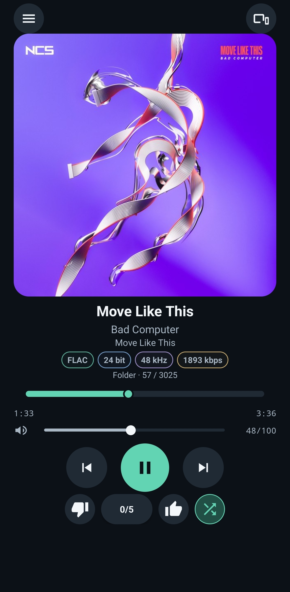
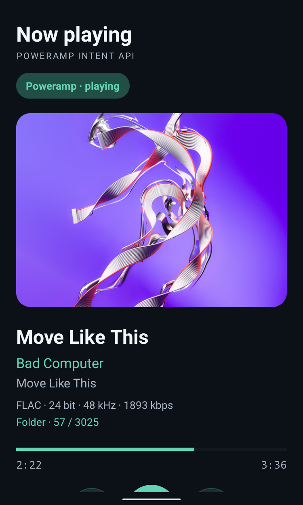
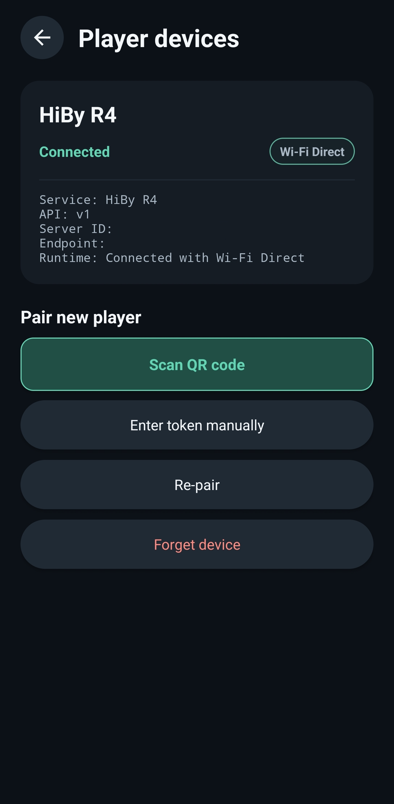
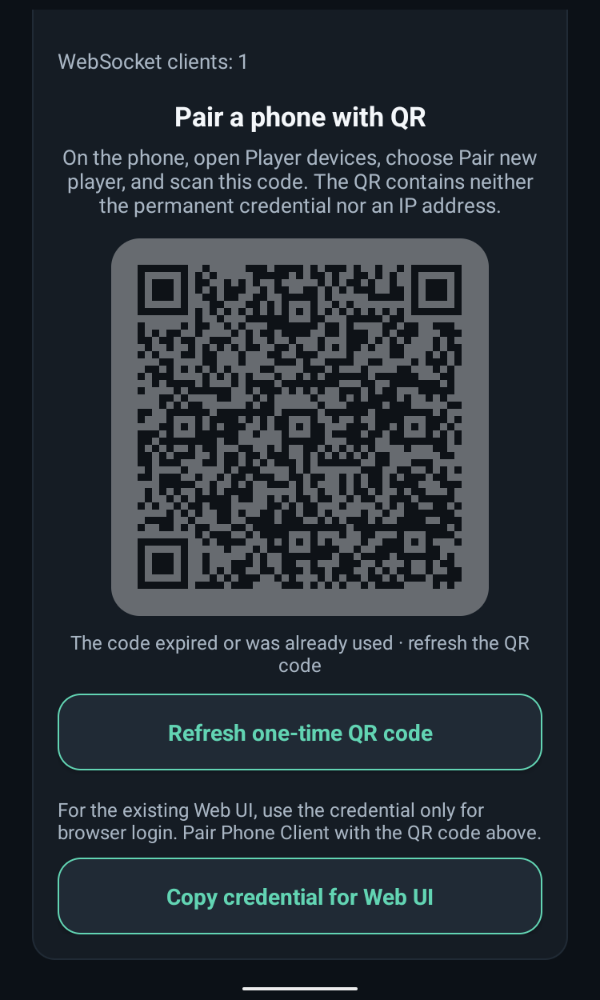

# Poweramp Remote

Poweramp Remote is an independent, open-source remote control for Poweramp on Android. It keeps
music playback on the player device while a second Android phone, a browser, Android system media
controls, or a compatible Wear OS controller operates it over a local connection.

Current versions:

- Server `0.11.0` (`versionCode 14`)
- Phone Client `0.7.0` (`versionCode 16`)
- local API `v1`

The Server and Phone Client are separate APKs with independent version numbers.

## Architecture

| Component | Runs on | Responsibility |
| --- | --- | --- |
| Server | Android device that runs Poweramp | Uses Poweramp's public Intent API, exposes the authenticated local API and Web UI, publishes LAN/Wi-Fi Direct discovery, and controls player-device volume. |
| Phone Client | A second Android phone | Owns discovery, pairing, reconnect, the remote player UI, and one Android MediaSession. It controls the Server and never receives or decodes audio. |

The Phone Client discovers `_poweramp-remote._tcp` with LAN NSD first. If the paired player is not
available on the LAN, it can automatically start the existing Wi-Fi Direct discovery path. Android
and OEM connection approval dialogs are always respected; LAN remains preferred when it returns.

## Features

- play/pause, previous, next, and precise seek;
- player-device media volume;
- title, artist, album, artwork, codec/file type, bit depth, sample rate, bitrate, source category,
  and current-list position;
- Like, Dislike, exact `0…5` rating, and shuffle state/control;
- event-driven WebSocket updates with resume/reconnect state restoration;
- address-free QR pairing with a short-lived one-time secret;
- manual persistent Bearer-token pairing as a camera-free fallback;
- LAN NSD discovery with automatic Wi-Fi Direct fallback;
- Android MediaSession, media notification/lock-screen controls, and compatible Wear OS controls;
- a compact Phone connection entry plus a main menu with Settings, app language, and About;
- an artwork-derived dark theme with smooth palette transitions and cached Previous/Next artwork
  gestures;
- animated playback controls, smooth event-driven seek presentation, a compact LAN/Wi-Fi Direct
  status indicator, and stable muted metadata-chip families;
- lazy Library browsing for tracks, artists, albums, folders, and playlists, with representative
  artwork and per-list sorting;
- categorized global Search with independent Tracks, Artists, and Albums results, typo-tolerant
  entity matching, structured artist/title queries, and local removable history;
- Queue viewing and exact-entry playback, plus single or ordered batch Add to Queue from track rows;
- complete English and Russian Phone UI, scanner, dialogs, accessibility text, and notifications;
- an authenticated English embedded Web UI for browsers on the local network.

## Screenshots

<table>
  <tr>
    <th>Phone Client — Now playing</th>
    <th>Server — Now playing</th>
  </tr>
  <tr>
    <td align="center" valign="top">
      
    </td>
    <td align="center" valign="top">
      
    </td>
  </tr>
  <tr>
    <th>Phone Client — Player devices</th>
    <th>Server — QR pairing</th>
  </tr>
  <tr>
    <td align="center" valign="top">
      
    </td>
    <td align="center" valign="top">
      
    </td>
  </tr>
</table>

## Requirements

- Android 8.0 (API 26) or newer on both devices;
- Poweramp installed on the Server/player device;
- Wi-Fi connectivity for LAN operation; Wi-Fi Direct support on both devices for fallback;
- notification and nearby-device permissions where requested;
- Location permission and Location Mode may be required for Wi-Fi Direct on Android 8–12L;
- a camera only for QR scanning—manual Bearer pairing remains available without one.

Wi-Fi Direct behavior varies by Android version and OEM. The Server/player device must become the
group owner for the current fallback connection to work.

## Installation and pairing

Download the two APKs from the [latest GitHub Release](../../releases/latest):

- `Poweramp-Remote-Server-v0.11.0.apk`
- `Poweramp-Remote-Phone-v0.7.0.apk`

The release also provides `SHA256SUMS.txt` plus the project and third-party license notices.

> **Library and Queue update:** install Server `0.11.0` over public Server `0.10.2` and Phone Client
> `0.7.0` over public Phone `0.6.0` without uninstalling. Both application IDs and the permanent
> release certificate are unchanged, so Server identity, API token, saved pairing, and Bearer
> credential remain in place. Both new APKs are required for the complete feature set.

> **Historical debug-build boundary:** pre-release APKs were signed with Android debug
> certificates. Release-signed APKs still cannot update those installations. Uninstall both old
> debug apps before installing a public release; uninstalling removes local credentials and pairing
> preferences, so pair Server and Phone again afterward.

Then:

1. Install the Server APK on the Android device that runs Poweramp. Open it, grant the requested
   permissions, and start the Server.
2. Install the Phone Client APK on the controlling phone and grant its requested permissions.
3. Keep both devices on the same LAN, open **Player devices**, choose **Pair new player**, and scan
   the QR code shown by the Server.
4. If QR scanning is unavailable, use the Server's explicit credential-copy action, choose
   **Enter token manually** on the Phone, and paste the Bearer token. Manual pairing discovers and
   verifies the Server on the LAN.

After successful pairing, the Phone Client stores the Server identity and credential in its private,
backup-excluded app storage and reconnects automatically. If LAN discovery fails, the client may
offer or start Wi-Fi Direct fallback; confirm any system dialogs shown on either device.

The Phone main screen uses a compact LAN/Wi-Fi Direct connection pill on the right; tapping it opens
**Player devices**. The menu button on the left opens **Settings** and **About**. Settings selects
**System default**, **Russian**, or **English** without changing pairing or stopping the connection
service; About shows exact installed version metadata, licenses, and repository links. System
default uses Russian only for a primary Russian system locale and English otherwise.

For browser control, open `http://<SERVER-IP>:8765/` from a device on the same trusted LAN and log
in with the credential copied through the Server's explicit Web UI credential action.

## Security

Poweramp Remote is local-first and has no cloud service. The QR code contains the stable Server ID,
API version, and a short-lived one-time pairing secret; it does not contain the persistent Bearer
credential or an IP address. A successful exchange invalidates the one-time secret.

The local API uses Bearer authentication, but HTTP and WebSocket traffic is not encrypted with TLS.
Use the project only on networks you trust. Do not port-forward the Server, expose port `8765` to
the internet, publish credentials or QR codes, or include pairing data in bug reports. Forget or
re-pair the player if a credential may have been exposed.

## Known limitations

- Audio stays on the player device; this project is a controller, not an audio-streaming client.
- Queue removal, clearing, reordering, and Play Next are not implemented because the audited public
  Poweramp API does not document those mutations. Lyrics are not implemented.
- Persistence currently targets one paired Server; full multi-player selection is not implemented.
- Wi-Fi Direct depends on platform/OEM support, permissions, Location Mode on older Android, group
  owner selection, and user-approved system prompts.
- Wear OS support is provided through the Phone Client's Android MediaSession; there is no separate
  Wear app.
- Some optional metadata depends on the installed Poweramp version and the current track.
- Local HTTP/WebSocket traffic is authenticated but unencrypted.

See the [roadmap](ROADMAP.md) for planned work and explicit non-goals.

## Development

The project uses Gradle Wrapper, JDK 17, and Android SDK 36. A full local verification run is:

```shell
./gradlew clean \
  :app:testDebugUnitTest :phone:testDebugUnitTest \
  :app:lintDebug :phone:lintDebug \
  :app:assembleDebug :phone:assembleDebug
```

OpenAI Codex is used as the primary coding agent for this project. Architecture, requirements,
product decisions, and real-device validation are directed and performed by a human; much of the
implementation, tests, refactoring, and documentation is produced collaboratively with Codex and
reviewed against those human-defined requirements.

Release APKs must use a permanent release signing key stored outside the repository. Maintainer
instructions and the fresh-install implications of the first public key are documented in
[`RELEASING.md`](RELEASING.md).

## License and attribution

Original Poweramp Remote code is available under the [MIT License](LICENSE). Poweramp API-derived
portions and bundled dependencies retain their own terms; see
[`THIRD_PARTY_NOTICES.md`](THIRD_PARTY_NOTICES.md) and the [`licenses`](licenses/) directory.

Poweramp Remote is an independent open-source project. It is not affiliated with, endorsed by,
sponsored by, or supported by Poweramp or Max MP. Poweramp and related names and logos are the
property of their respective owners and are used only to describe compatibility.

> Google Play Protect may classify a sideloaded release as an “Uncommon” app. This warning does not
> by itself indicate a detected malware category. Download APKs only from this repository and verify
> them against `SHA256SUMS.txt` before installation.
